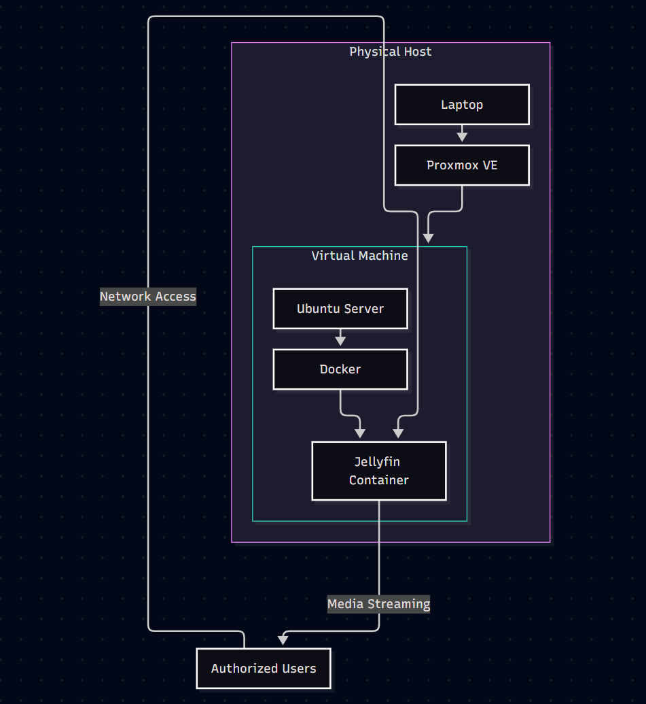

# Home-Lab
Personal homelab using Proxmox VE to run an Ubuntu VM hosting a Docker-based Jellyfin media server.

## Reasoning
I decided to undertake this project to gain hands-on experience with virtual machines and managing multiple containers in a virtualized environment. I also wanted to better understand how the client-server model works by using an older laptop as a server that allows authorized users to access media remotely.

A major goal of this project was to demonstrate how older hardware can be given a second life. While the laptop may no longer meet the requirements for newer operating systems such as Windows 11, installing a lightweight Linux-based operating system and using virtualization allows the hardware to remain useful. This project gave me practical experience in repurposing existing technology rather than replacing it, while also learning about virtualization, Linux, containers, networking, and server management.

## Infrastructure

Laptop
└── Proxmox VE
    └── Ubuntu VM
        └── Docker
            └── Jellyfin

## Purpose

This homelab is used to gain hands-on experience with:

- Linux system administration
- Virtualization
- Docker containers
- Networking
- Server management
- Troubleshooting

## Services

### Jellyfin
Self-hosted media server running inside a Docker container on Ubuntu.

## Network Topology

****

